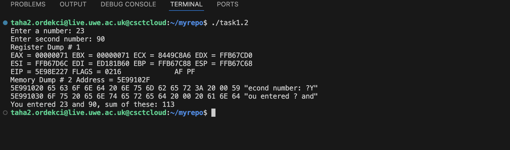
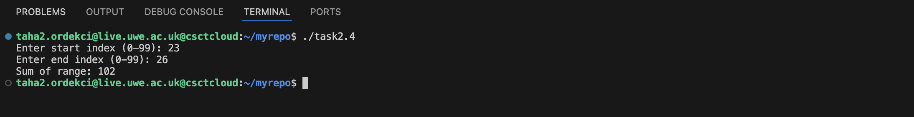

# Operating Systems - Worksheet 1

This is my first assembly programming worksheet. It covers basic assembly stuff, loops, if statements, and using Make to build everything automatically.

---

## What's Inside

- [Task 1: Basic Assembly Programs](#task-1-basic-assembly-programs)
- [Task 2: Loops and Conditionals](#task-2-loops-and-conditionals)
- [Task 3: Build Automation with Make](#task-3-build-automation-with-make)
- [How to Build and Run](#how-to-build-and-run)
- [What I Learned](#what-i-learned)

---

## Task 1: Basic Assembly Programs

### Task 1.1 - Simple Addition
This one just adds two numbers together. Pretty straightforward - the numbers are already in the code, so you don't type anything in.

The main thing here is loading values from memory into registers, doing the math, and showing the result.

```nasm
mov     eax, [num1]             ; Load first number into EAX
add     eax, [num2]             ; Add second number to EAX
mov     [result], eax           ; Store result in memory
```

Basically it loads the first number, adds the second one to it, and saves the answer. The `add` instruction does what you'd expect - adds stuff together.

**Screenshot:**


---

### Task 1.2 - Interactive Addition
This is like 1.1 but now you actually type in the numbers yourself. It reads two numbers, adds them, and shows everything including register values.

```nasm
call    read_int                ; Read integer into EAX
mov     [input1], eax           ; Store in memory

; Later - calculate sum
mov     eax, [input1]
add     eax, [input2]           ; EAX now contains the sum
mov     ebx, eax                ; Save sum in EBX for later use
```

So `read_int` gets your input and puts it in EAX. Then we save it, do the same for the second number, and add them. The `dump_regs` thing shows all the register values which was helpful for understanding what's going on.

**Screenshot:**



---

## Task 2: Loops and Conditionals

### Task 2.1 - Prime Number Finder
This one finds all the prime numbers up to whatever number you choose. It checks each number by trying to divide it by everything smaller.

```nasm
try_next_divisor:
    mov     eax, [candidate]        ; Number to test
    mov     edx, 0                  ; Clear for division
    mov     ebx, [divisor]          
    div     ebx                     ; Divide: remainder in EDX
    
    cmp     edx, 0                  ; Check remainder
    je      not_prime               ; If 0, it's divisible = not prime
```

The way it works is for each number, we divide it by 2, 3, 4, etc. If the remainder is 0, it means the number divides evenly so it's not prime. If we get through all the possible divisors and nothing divides evenly, then it's prime.

**Screenshot:**


---

### Task 2.2 - Personalized Welcome Message
You type your name and a number (between 51-99), then it prints a welcome message that many times with your name in it.

```nasm
read_name_loop:
    call    read_char              ; Read one character
    cmp     al, 10                 ; Check for newline (Enter)
    je      name_done              
    mov     [edi], al              ; Store character
    inc     edi                    ; Move to next position
    jmp     read_name_loop

name_done:
    mov     byte [edi], 0          ; Null terminate string
```

This reads your name one character at a time until you press Enter. EDI keeps track of where we are in the buffer. At the end we add a null terminator (which is how strings end in assembly). It also checks if you entered an empty name and makes you try again if you did.

**Screenshot:**


---

### Task 2.3 - Array Sum (1 to 100)
Makes an array with numbers 1 through 100 in it, then adds them all up.

```nasm
; Initialize array
mov ecx, 100                   ; Counter
mov ebx, 1                     ; Value to store
mov esi, my_array              ; Pointer to array

init_loop:
    mov [esi], ebx             ; Store value
    add esi, 4                 ; Move to next dword (4 bytes)
    inc ebx                    ; Next value
    loop init_loop
```

ESI is a pointer that moves through the array. Since each number takes 4 bytes (dword), we add 4 to move to the next spot. First loop fills it with 1-100, second loop adds them all up. The answer should be 5050 (there's a formula for this: n(n+1)/2).

**Screenshot:**


---

### Task 2.4 - Range Sum
Like 2.3 but now you pick which part of the array to add up. So if you say start at 10 and end at 20, it only adds those numbers.

```nasm
get_start_index:
    call read_int
    mov [start_idx], eax
    
    ; Validate (0-99)
    cmp eax, 0
    jl invalid_start           ; Loop back if invalid
    cmp eax, 99
    jg invalid_start

; Calculate element address
sum_loop:
    mov eax, ecx               ; Current index
    shl eax, 2                 ; Multiply by 4 (shift left 2 bits)
    mov ebx, array
    add ebx, eax               ; EBX = address of array[index]
    mov eax, [ebx]             ; Get value
    add [sum], eax             ; Add to sum
```

Had to figure out the array indexing for this. The address formula is: base + (index × 4). The `shl eax, 2` shifts left which multiplies by 4 - apparently this is faster than using multiply. Also added validation so it keeps asking if you enter invalid numbers.

**Screenshot:**



---

## Task 3: Build Automation with Make

### Makefile
Made a Makefile so I don't have to type out the nasm and gcc commands every single time. 

You can do:
- `make` or `make all` - builds everything
- `make task1.1` - builds just one program
- `make clean` - deletes all the compiled files

```makefile
# Default target
all: task1.1 task1.2 task2.1 task2.2 task2.3 task2.4

# Example rule for building a program
task1.1: $(SRC_DIR)/driver.o $(SRC_DIR)/task1.1.o $(SRC_DIR)/asm_io.o
	$(GCC) $(GCC_FLAGS) $(SRC_DIR)/driver.o $(SRC_DIR)/task1.1.o $(SRC_DIR)/asm_io.o -o task1.1

# Pattern rule for assembly files
$(SRC_DIR)/%.o: $(SRC_DIR)/%.asm
	$(NASM) $(NASM_FLAGS) $< -o $@

# Clean target
clean:
	rm -f $(SRC_DIR)/*.o $(ALL_TARGETS)
```

The Makefile checks dependencies and only rebuilds what changed. The `%` is a wildcard that matches any file. `$<` is the input and `$@` is the output. Pretty handy once you get used to it.

**Screenshot:**


---

## How to Build and Run

### Building
```bash
# Build all programs
make

# Build specific program
make task1.1

# Clean build files
make clean
```

### Running
```bash
# Run any program
./task1.1
./task2.3
# etc.
```

---

## What I Learned

This worksheet taught me a lot about how computers actually work at a low level.

### Assembly Stuff
- **Registers** - EAX, EBX, ECX, etc. are like tiny variables in the CPU. Each one has specific uses.
- **Memory** - How to load stuff from memory and save stuff back to memory
- **Math** - ADD is simple, but DIV is weird because it puts the remainder in EDX
- **Jumps** - Using JE (jump if equal), JG (jump if greater), etc. to make decisions and loops

### Techniques I Used
- **Arrays** - Moving through arrays by adding 4 each time (for 4-byte integers)
- **Input validation** - Making loops that keep asking until you enter valid input
- **Strings** - Reading character by character and adding a null at the end
- **Bit shifting** - Using SHL instead of multiply because it's faster

### Build Tools
- **Make** - How to write Makefiles with targets and dependencies
- **Pattern rules** - One rule that works for multiple files
- **Efficiency** - Make only recompiles what changed instead of everything

### Debugging
- Using `dump_regs` to see what's in all the registers
- Testing with known answers (like the sum formula) to make sure it works

The hardest part was probably getting the array indexing right in task 2.4 and understanding how the DIV instruction works with remainders. Also took a bit to wrap my head around pointer arithmetic.

---

## Files

```
.
├── Makefile
├── README.md
├── screenshots/
│   ├── task1_1.png
│   ├── task1_2.png
│   ├── task2_1.png
│   ├── task2_2.png
│   ├── task2_3.png
│   ├── task2_4.png
│   └── make_output.png
└── src/
    ├── asm_io.asm
    ├── asm_io.inc
    ├── driver.c
    ├── task1.1.asm
    ├── task1.2.asm
    ├── task2.1.asm
    ├── task2.2.asm
    ├── task2.3.asm
    └── task2.4.asm
```

---

**Author:** Taha Ordekci  
**Student Number:** 25013992  
**Module:** UFCFWK-15-2 Operating Systems